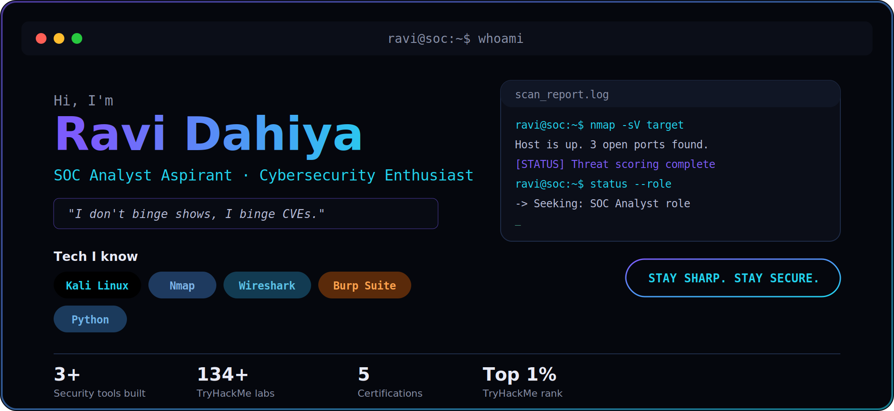
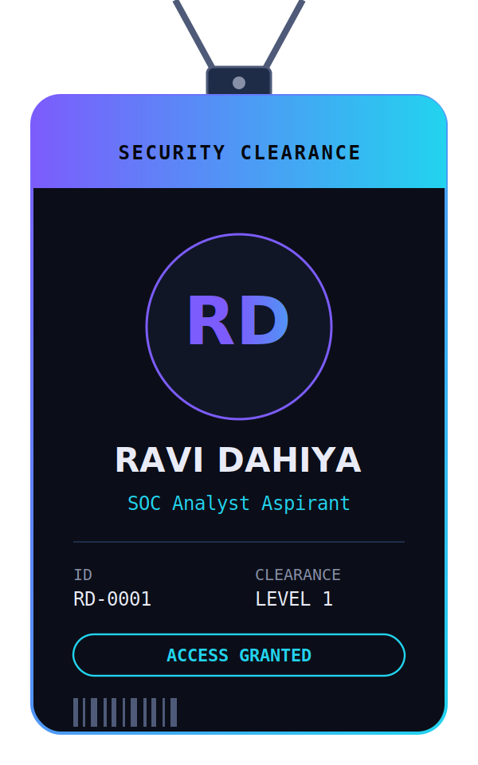

  

  
  
  
  

---

## 🚀 About Me
- 🔐 Passionate about cybersecurity & ethical hacking  
- 🌐 Skilled in network analysis & vulnerability detection  
- 🛠️ Building real-world security tools using Python  
- 🏆 Ranked Top 1% on TryHackMe with 134+ completed labs

---

## 🛠️ Skills & Tools

---

## 🔥 Featured Projects

<table>
<tr>
<td width="180">

</td>
<td>

| 🛡️ Project | 💻 Tech |
|---|---|
| [🕵️ Smart Honeypot System](https://github.com/RaviDahiya0001/Smart-Honeypot-System-for-Analyzing-Zero-Day-Attacks-) | `Python` `Django` `Redis` |
| [🔎 Port Scanner](https://github.com/RaviDahiya0001/port-scanner) | `Python` |
| [🔑 Password Strength Checker](https://github.com/RaviDahiya0001/password-strength-checker) | `Python` |
| [📡 Packet Sniffer](https://github.com/RaviDahiya0001/packet-sniffer) | `Python` |

> 🔐 *"I don't binge shows, I binge CVEs."*

</td>
</tr>
</table>

---

## 📜 Certifications
- Cisco Cybersecurity Certifications  
- Cloud Computing (Codersed)  

---

## 📊 GitHub Stats & Graphs

  
  

  

  

  

---

## 🐍 Watch the snake eat my contributions

  

---

## 📫 Let's Connect
- 🌐 Portfolio: https://ravi-portfolio1-chi.vercel.app/  
- 🔗 GitHub: https://github.com/RaviDahiya0001  
- 🔗 LinkedIn: https://linkedin.com/in/ravi-dahiya-470371334  
- 🎯 TryHackMe: https://tryhackme.com/p/rd893084  
- 📧 Email: dahiyaravi0002@gmail.com  

  

---

⚡ <b>"Breaking systems to secure them."</b>

